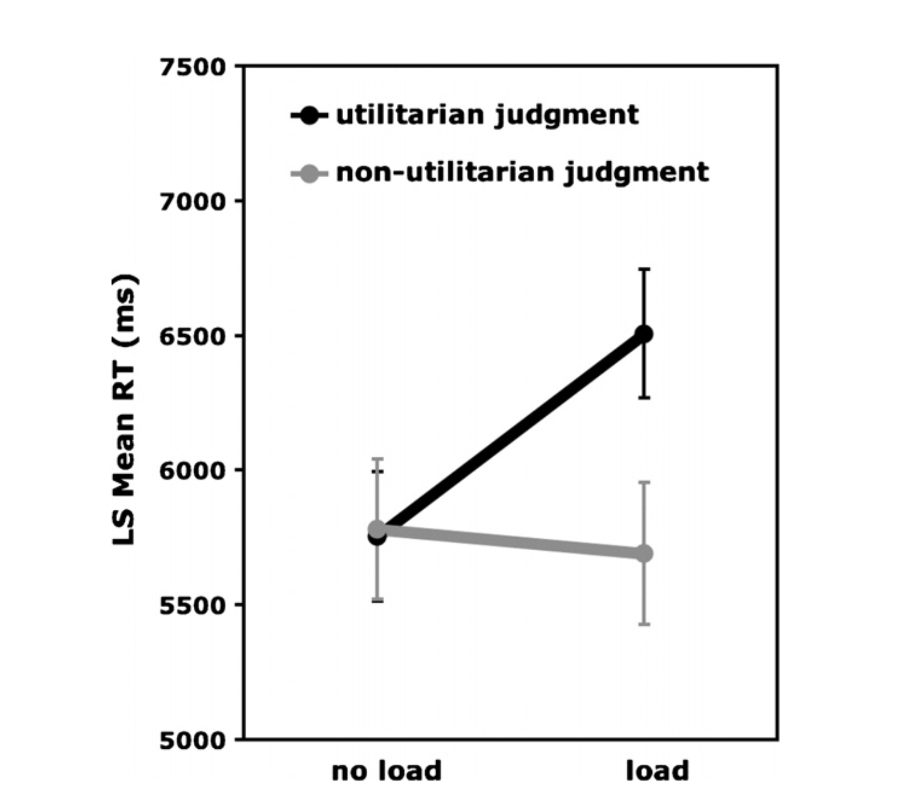

<!-- Reproducibility reports should all use this template to standardize reporting across projects. These reports will be public supplementary materials that accompany the summary report(s) of the aggregate results. -->

## Introduction

In this project I will be reproducing the main finding of the paper,
that is the effect of cognitive load on moral decision making. Greene et
al, present 40 total vignettes of moral decisions that require either
deontological (rule based) decisions or utilitarian (consequence based)
decisions. While there is no difference in response time (RT) for
either, with the presence of load, utilitarian responses have a longer
RT on average. The study is a within-between design so all participants
are in both no load and load groups and the RT is taken and averaged by
judgement (deontolgical/utilitarian).

The main finding that I am looking to replicate is the effect of load on
RT for utilitarian decision making. This would be a mixed effects linear
model looking at the effect of moral choices and load condition on the
response time.

### Justification for choice of study

I choose to replicate this study as it's a seminal piece in moral
psychology. Furthermore, I am interested in dual-process decision making
theories and Greene's work was informative for "fast/slow" models. This
piece builds on previous work by Greene in 2001 and will become a key
finding for their work in model-free, model based moral decision making,
Kanheman's "Thinking Fast Thinking Slow" and more.

### Anticipated challenges

One challenge I anticipate in attempting to replicate this study is
getting sufficient responses from participants as there are many
vinnettes and I could imagine that there will be a great deal of
satisficing.

Further, I anticipate challenges with collecting similar response times.

### Links

Project repository (on Github):

Original paper (as hosted in your repo):

<https://github.com/lynde-m-folsom/Replications/blob/main/Greene_Rep/Original_paper/Greene_Cohen_Cog2007.pdf>

## Methods

### How we intend to replicate

First, designing a task that is similar to the original. This
replication will be conducted online so the first challenge is
replicating the task design for presenting the stimuli. The dilemmas are
presented as scrolling text across a screen with the cognitive load
condition including a scrolling number line.

Next, piloting the data to see that the response time (RT) is reasonable
compared to the original paper. After gathering data, calculating the
mean and standard deviations for load/no load conditions. Per original
paper, RT is then trimmed to within 2standard deviations for each mean
RT removing outliers. Finally a series of linear models to see if we can
replicate the main effect in the paper.

Model 1: Effect of choices on RT: In this model we're looking to see if
utilitarian choices have a different RT compared to their non
utilitarian counterparts.

Model 2: Effect of load conditions on RT: This model to see if the
cognitive load condition effects the RT. We predict it will but authors
found no effect until running the mixed effects model.

Model 3: Mixed effects model of choice and load on RT: This is the model
that has the significant effects in the original paper wherein cognitive
load selectively slows the RT of utilitarian choices. I predict this
effect will not replicate.

### Differences from original study

One major difference is that I will be conducting this study online
rather than in person. This means my population will not be Princeton
undergraduates and may represent more diversity in age and other
demographics. This may have a role in how people make moral decisions as
well as things like reading speed and general response time.

Another major difference is that for the original study 40 dilemmas were
presented and only 12 were included for the results. In this study I
will only present the 12 that were used for their findings. This
shortens the study significantly but also, I hope, prevents satisficing.

Finally, in making the task, the speed of the scrolling text and numbers
is not replicable from the description in the paper. Using CSS code, for
most devices the speed of the scrolling text should be hypothetically
similar to the scrolling speed for the original study, however I cannot
confirm that the speed is exactly 16character/s for every participant.
During piloting, I intend to have a variety of devices such that I can
confirm the speed of scrolling effect does not interfere with the
capacity to read with the text.

### Measure of success

The measure of success here will be weather we can replicate the main
finding of cognitive load selectively interfering with utilitarian
choices. This would be demonstrated as a significant result in a mixed
effect model of load \* condition on RT with participants as a random
effect.

## Results

### Data preparation

Data preparation following the analysis plan. #Library

```{r libraries and such, echo=FALSE, include=FALSE}
library("knitr")
library("janitor")     
library("broom.mixed") 
library("lme4")
library("emmeans")
library("tidyverse")
library("afex")
library("report")
library("readr")
library("qualtRics")
library("reshape2")
library("DataExplorer")
library("sjPlot")
library("sjmisc")
library("ggplot2")
library("modelbased")
library("esquisse")
opts_chunk$set(comment = "",
               fig.show = "hold")
```

### Setup

```{r setup, include=FALSE, message=FALSE}
knitr::opts_knit$set(root.dir = "~/F.Replications/Replications/Greene_Rep/Data")

# Disable summarize ungroup messages
options(dplyr.summarise.inform = FALSE)
```

### Bring in Data & organize it

-   Read in data

-   Select the variables (IVs/DVs)

-   Remove pilot data & Qualtrics headers

-   Pivot long

-   Trim RT to 2SD of mean

-   Look at the histogram of RT

-   Look at the violins of choice/load RT

```{r include=T}
#### Import data
raw_data <- read_survey("Greene_08_Rep_121422.csv", legacy = TRUE) %>%
  clean_names()
#### Data exclusion / filtering
#grab the variables I want
df.data <- select(raw_data,
                  "prolific_id",
                  contains("l1"),
                  contains("l2"),
                  -contains("page_submit"),
                  -contains("last_click"),
                  -contains("click_count")) 
#remove the pilot & qualtrics headers that I don't want
df.data <- df.data %>% 
  filter(prolific_id !="beth")%>% 
  filter(prolific_id !="kate") %>% 
  filter(prolific_id !="ImportId") %>% 
  filter(prolific_id !="test001_JWB") %>% 
  filter(prolific_id !="asdf") %>% 
  filter(prolific_id != '{"ImportId":"QID33_TEXT"}') 
#### Prepare data for analysis - create columns etc.
df.datalong <- df.data %>% 
  group_by("prolific_id") %>% 
  pivot_longer(
    cols = !"prolific_id",
    names_to = c("trial", "load"),
    names_sep = "_",
    values_to = "choice") 

df.datalong <- df.datalong %>% 
  filter(choice != "prolific_id" )
## Pesky row that Anna helped move
odd.ind <- seq_len(nrow(df.datalong)) %% 2
df.datalong.odds <- df.datalong[odd.ind == 1, ]
df.datalong.evens <- df.datalong[odd.ind == 0, ]

df.datalong.odds$bin.choice <- df.datalong.evens$choice

df.datalong
df.datalong.odds

new.df.datalong <- df.datalong.odds

df.datalong <-new.df.datalong %>% 
  rename(rt = "bin.choice")

df.datalong <-df.datalong %>% 
  mutate(rtnum = as.numeric(rt)) %>% 
  mutate(choicenum = as.factor(choice)) 

## RT Trimming like in original paper

sumsdfdatalong <- df.datalong %>% 
  group_by(load) %>% 
  summarize(rtmean = mean(rtnum),
            stdrtmean = 2*sd(rtnum),
            minrt = rtmean-stdrtmean,
            maxrt = rtmean+stdrtmean)

minrt <- sumsdfdatalong$minrt
maxrt <- sumsdfdatalong$maxrt

df.datalongtrim <- df.datalong %>% 
  group_by(load) %>% 
  filter(rtnum > minrt) %>% 
  filter(rtnum < maxrt)

## Lets see the data so far
df.datalongtrim %>% 
  ggplot(mapping = aes(x = load,
         y = rtnum,
         fill = choicenum
        ))+
  geom_violin()+
  labs(x = "Load Conditions",
       y = "Response Time (seconds)")+
  scale_x_discrete(labels=c("l1" = "No Load",
                            "l2" = "Load"))+
  scale_fill_discrete(name="Choice type",
                  labels=c("1" = "Utilitarian",
                           "2" = "Not Utilitarian"))

```

### Key analysis

-   3 linear models (participant as random effect)

    -   

        a)  RT \~ Choice

    -   

        b)  RT \~ Load

    -   

        c)  RT \~ Load \* Choice

-   Anova model comparisons

-   Plot the results

```{r model time, echo=TRUE}
#modeling choice
m1<- lmer(rtnum ~choicenum +(1|prolific_id),
          data = df.datalongtrim)
report(m1) 
summary(m1)

#modeling load 
m2 <- lmer(rtnum ~load +(1|prolific_id),
           data = df.datalongtrim)
report(m2)
summary(m2)

#model the load*choice and rt
m3 <- lmer(rtnum ~load *choicenum +(1|prolific_id),
           data = df.datalongtrim)
report(m3)
summary(m3)

#looking at model comparisons
anova(m2, m3)
anova(m1, m2)
anova(m1, m3)

#save model outputs to make a figure
means <- estimate_means(m3)

as.factor(means$load) #this will make the graphing easier

means %>% 
  ggplot(mapping = aes(x = load,
                       y = Mean,
                       group = choicenum,
                       color = choicenum
                        ))+
  geom_line(linewidth = 2.5)+
  geom_errorbar(aes(ymin=CI_low, ymax=CI_high), width=.06, size = 1)+
  geom_point()+
  labs(title = "Effect of Load and Moral Choice on RT",
       x = "Load Conditions",
       y = "Response Time Means (seconds)")+
  scale_x_discrete(labels=c("l1" = "No Load",
                            "l2" = "Load"))+
  scale_colour_grey(name="Choice type",
                  labels=c("1" = "Utilitarian",
                           "2" = "Not Utilitarian"),
                  start = 0.3,
                  end = 0.7)

```

### Compare to the original figure



```{r, include=F}
fig1<-include_graphics("Figures/Greene_Fig1.png")
fig1 
```

## Discussion

### Summary of Reproduction Attempt

We found that RT significantly increases with the presence ense of load
which confirms our hypothesis. However, this differs from the original
paper which does not find this effect until running the mixed effect
model. Further, we find that our RT mean is significantly different from
the original RTs reported (original= 5.8s appx, current study = 52s).
And finally we do not find a significant difference between
utilitarian/non utilitarian choice under load.

### Commentary

Considering the failure to replicate the effect, follow up questions I
have for this study are as follows.

It is not clear to me that the "load" condition is a introducing
cognitive load rather than visual interference. Other cognitive load
literature often cite that tasks with conflicting sensory stimuli
introduce sensory noise which I am not sure can be considered "cognitive
load" (2015). A better load condition may be something like an auditory
odd-ball paradigm or n-back task in which a different cognitive modality
is being used simultaneously rather than dual sensory processing().

Further, the scrolling text makes for a challenging task without
introducing a load component, I would like to see how RT and judgment is
effected by introducing scrolling text.

The content of the dilemmas are very similar. I believe this introduces
a possible meta-cognitive factor that can reduce the cognitive load of
the task by responding in a "heuristic" kind of way.

Finally, the dilemmas all follow a similar model based off the trolley
problem but with extreme consequences. I'm unsure the ecological
validity of running graphic moral dilemmas to represent moral choices.
These dilemmas are based off of philosophical thought experiments
designed to solicit specific hypothetical responses not to solicit
realistic responding. By adding graphic elements to the task I'm unsure
if we get closer to understanding the relationship between cognitive
processes and moral decision making.
